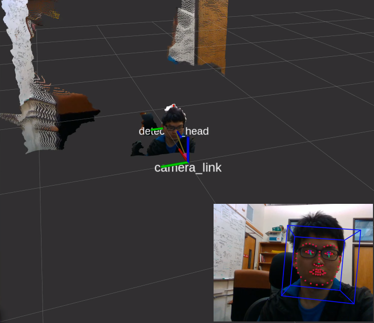

# OpenFace ROS package

Repository that hosts software libraries and ROS packages for gaze and emotion detection, performed at the Human Interaction and Robotics Lab in University of Colorado at Boulder.



The software in this repo has been developed for, and tested on, a Sawyer Research Robot and Realsense---a widely used platform for research in HRC. Nonetheless, it is easy to customize to any robotic platform that shares similar hardware features.

## Installation

Guide for installing, compiling and testing the openface_ros package in your ROS environment. This tutorial should be useful regardless of your skill level, from a first-time ROS user to an experienced engineer.

### Prerequisites

#### System Dependencies

This repository needs `openface` and `realsense`. To install, compile and test openface package, please refer to the [installation tutorial](https://github.com/TadasBaltrusaitis/OpenFace/wiki) in openface github wiki page. Also, for realsense package, please refer to the [installation tutorial](https://github.com/IntelRealSense/realsense-ros) in realsense github page.

#### ROS Dependencies

This repository supports `ROS kinetic`. [Here](https://hiro-group.ronc.one/ros_kinetic_installation.html)'s a recently guide on how to install ROS.

##### Catkin Tools

We use the new Catkin Command Line Tools `catkin_tools`, a Python package that provides command line tools for working with the catkin meta build system and catkin workspaces. This package was announced in **March 2015** and is still in beta, but we didn't experience any problem with it. The following instructions apply to this new package, even though the repository can be used and compile with the old `catkin_make` without issues.

```
sudo apt-get install python-catkin-tools

## How to run this package

After cloning and building this repo, you can run `roslaunch openface_ros openface_ros.launch` to launch all the setting we need. And then run `rosrun openface_ros openface_realsense` to start main program.

## Functions of OpenFaceRos

* `OpenFaceRos constructor`: For constructor, we need focal length, center of realsense, threshold of distance betwenn gaze vector and target and a flag enable action unit or not.

* `getNose, getLeftPupil, getRightPupil`: These three function will give you position of nose, left pupil and right pupil individually. The location is pixel-based, which means location in showing image.

